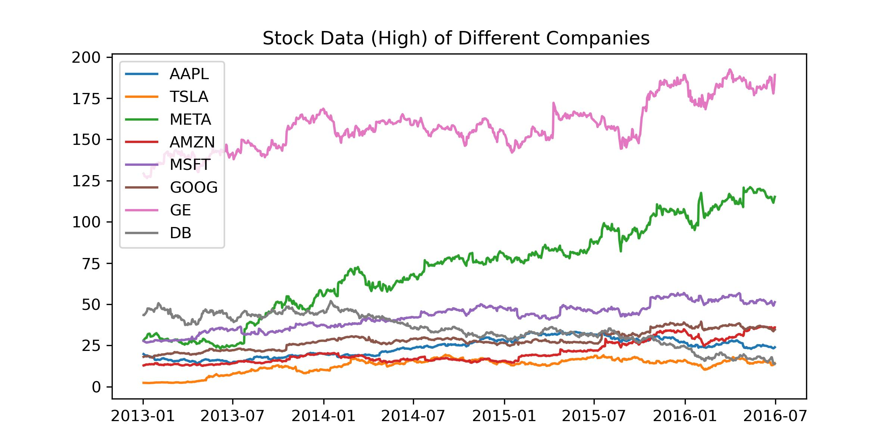

# Modern Potfolio Theory 

# Review of Statistics (Mean and Variance)
In here, we review the basic of statistics for later use of understanding portforlio theory (Markowitz Model). Given an random vairable $X$ and the its distribution. The expectation value of $X$ is given by 

$$
\mathbb E [ X ] = \sum_k p_k x_k,~~\text{or}~ \int  p(x) x dx 
$$

For instance, if $X \sim Bin(n,p)$ the corresponding distribution of a random variabl $X$ is 

$$
P(X = k) = { n\choose k} p^k q^{n-k}, 
$$
and the corresponding expectation value is 

$$
\mathbb E (X) = \sum_k k {n \choose k} p^k q^{n-k}  = np. 
$$

One shorter way to come up with the expectation of Binomial distributed variables is by imagining there are total $n$ trial and each of them is distributed as $Bern(p)$ **independently**. Therefore, we have 

$$
X = I_1 + I_2 + \cdots +  I_n, ~ I_i \sim Bern(p), 
$$

By linearity of expectation value, 

$$
\mathbb E(X) = \mathbb E(I_1 + I_2 + \cdots + I_n) = \mathbb E(I_1) + \cdots + \mathbb E(I_n) = np 
$$

Apart from the expectation values, the **variance** of a given random variable is also telling. The variance is given by 

$$
\begin{align*}
\mathbb E [ ( X - \mu)^2 ] &=\mathbb E [ X^2 - 2 \mu X + \mu^2    ] \\
&= \mathbb E(X^2) - 2 \mathbb E(X)^2 + \mathbb E(X)^2 \\
&= \mathbb E(X^2) - \mathbb E(X)^2
\end{align*}
$$

The variance is always positive. We can prove it using Jensne's inequality since $X^2$ is a convex function. Let a square function be $f( \cdot) = (\cdot)^2$. Using Jensen's inequality we cna show that 

$$
\begin{align*}
f(\mathbb E (X)) \leq \mathbb E ( f(X))  \implies \mathbb E(X)^2 \leq \mathbb E(X^2),
\end{align*}
$$

thus the variance is always positive. The **standard deviation** is defined as 

$$
\sigma = \sqrt{ Var(X) }
$$

which is a measure of how “spread out” the distribution is. For multivariables cases, we promote the concept of variance to **covariance** 

$$
Cov(X,Y) = \mathbb E [ (X- \mu_X) (Y - \mu_Y)  ],
$$

which we can easily compute with a joint distribution of random variables $X$ and $Y$ or more. The covariance measures the tendancy of two r.v.s go up or down together, relative to their mean. Positive covariance means that both $X$ and $Y$ goes up while negative covariance refers to  $X$ goes up and $Y$ goes down. In most cases, we use correlation instead of covariance since correlation is bounded by $-1 \leq Corr(X,Y) \leq 1$ and the definition of correlation of two r.v.s is 

$$
Corr(X,Y) = \frac{  Cov(X,Y)}{\sqrt{Var(X)Var(Y)}}
$$

By dimensional analysis, the correlation is a dimensionless measure of how two r.v.s vary together. 

# Diversification in Modern Portfolio Theory 

The modern portfolio theory (MPT) or Markowitz model was invented in 1952. The MPT or Markowitz model aims at optimize a certain portfolio to maximize the return (mean) within an acceptable level of risk (variance). A **portfolio** is a collection of financial investments such as stocks, bonds, and commodities. In the optimization the model will select the **most efficent portfolio** by considering various possible portfolios of the retun and risk. 

The main idea of Markowitz model is that investing all the money in a single stock is very risky because **stock is quite volatile** and unpredictable. Instead of investing single stock, Markowitz proposed that we may combine different assets (e.g. stocks) to reduce the risk as much as possible. This is also known as **Diversification**

> **Markowitz Mean-Variance Model** : *Reduce the risk by combining different assets*  
>

 
*The stock prices of different companies. This is an example of our portfolio including 8 companies. As we can see that the stock prices fluctuated in between 2013 to 2016. When one stock price went up, the other might go up or down. Therefore, combining these effects makes our portfolio more predictable in order to hedge risk.* [code](./codes/MPT_Markowitz_Model.ipynb)

Before going to the indepth mathematical discussion of Markowitz model, there are some assumptions associated with it 

* **Return are normally distributed** with mean $\mu$ and variance $\sigma^2$
* Investors are **risk-adverse**: investors will take more risk if they are expecting more return. For instance, bonds are less risky but with less return while stocks are risky but with high return. The modern portfolio theory states that investors can construct an optimal portfolio which maximizes their return given an acceptable level of risk. 

> **Efficient Portfolio**: *The portfolio that has the highest return but with the lowest risk.*
>

# Mathematical Formulation of Markowitz Mean-Variance Model 

# Efficient Frontier and Sharpe Ratio 

# References 
* [Wikipedia: Modern Portfolio Theory](https://en.wikipedia.org/wiki/Modern_portfolio_theory)
* [金工金數推導(5)——Markowitz Mean-Variance Portfolio](https://zhuanlan.zhihu.com/p/380290863)
* [投資組合論论（一）：Markowitz均值-方差模型](https://zhuanlan.zhihu.com/p/158994244)
* [Washington U Notes](https://sites.math.washington.edu/~burke/crs/408/fin-proj/mark1.pdf)
* [HKUST Notes](https://palomar.home.ece.ust.hk/ELEC5470_lectures/slides_portfolio_optim.pdf)
* [Utah University Notes](https://www.math.utah.edu/~zhu/5765.17s/week10.pdf)

